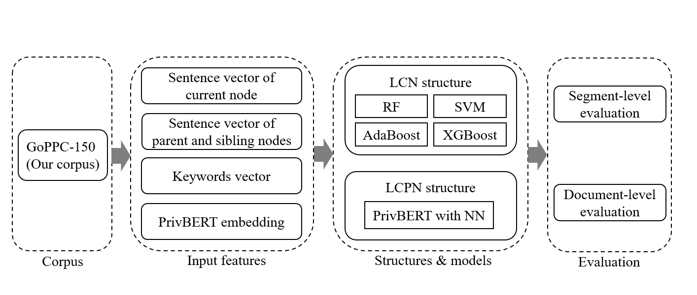

# A Comprehensive Study on GDPR-Oriented Analysis of Privacy Policies: Taxonomy, Corpus and GDPR Concept Classifiers


## Introduction

This is the official repository of A Comprehensive Study on GDPR-Oriented
Analysis of Privacy Policies: Taxonomy, Corpus
and GDPR Concept Classifiers.

Automated compliance analysis with the EU GDPR is in high demand. However, previous studies emphasizing sentence-level labels might inflate performance metrics. Also, the lack of a more complete GDPR taxonomy and the
less consideration of hierarchical information in privacy policies affect the conduct of research. To bridge these gaps, we've introduced a thorough GDPR taxonomy, a corpus of labeled policies with hierarchy, and conducted a detailed assessment of classifier performance at both sentence and document levels. This repository contains our proposed taxonomy, corpus, and all code used in the study.



## Project Directory Structure
```shell
|-- code # Contains all the code used in the paper
|   |-- pipeline # The pipeline from HTML crawling to compliance checking
|       |-- auto_html_save.py # Automatically saves HTML
|       |-- dataPreprocess.py # Preprocesses data to generate input for compliance checking
|       |-- bodyExtraction.py # Extracts the body of HTML
|       |-- tagFilter.py # Part of preprocessing 
|       |-- xmlConvertion.py # Converts HTML to XML
|       |-- ComplianceChecker.py # Checks the compliance of privacy policy
|       |-- ETtrees # Model used to classify paragraphs and titles
|       |-- label_convertion.py # Converts numbers to labels
|       |-- template_dic.py # Templates for GDPR concepts
|       |-- utils.py # Contains utility functions used by other files

|   |-- train # Contains training code used in the paper
|       |-- Embedding # Generates embeddings of inputs
|           |-- bert_finetuning.py # Fine-tunes BERT to get better embeddings
|           |-- get_bert_embeddings.py # Generates BERT embeddings
|           |-- get_tfidf_embeddings.py # Generates TF-IDF embeddings
|       |-- type1-type12 # Contains different types of classifier training and testing code
|           |-- train_segment.py(train_document.py) # Training code at different levels

|-- data  # Contains data used and generated
|   |-- GoPPC-150 # Our proposed corpus
|       |-- 1.xml-150.xml # 150 labeled privacy policies with hierarchy 
|   |-- complete_classifier_results.csv  # Type1-Type12 results at different levels
|   |-- Torre et al.\'s_classifiers_results # Results from Torre et al.\'s classifier
|   |-- opp_results.csv # Old evaluation and our evaluation results on OPP-115 datasets
|   |-- keyword_list.csv # Keyword list for each of the 96 concepts in GDPR taxonomy
|   |-- Web_list.csv # List of websites in our corpus
|   |-- GDPR_taxonomy.pptx # GDPR taxonomy
|   |-- readme.md # Description for this directory
```

## Citation

Please cite it if you find the repository helpful. Thank you!

```

```